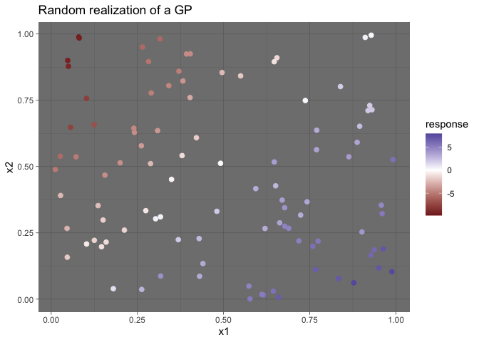
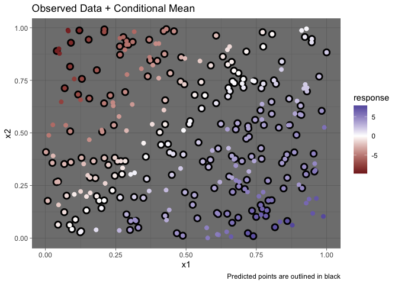

HW3
================

### Q1. GP Regression in 2D (12 points)

This question will continue the theme from the GP Demo on Friday
February 12.

#### Simulate GP regression in 2D (4 points)

Simulate and visualize a GP in 2d with a covariate structure. To keep
this simple, consider an additive relationship with the covariates, x1
and x2. While not required, take some time to explore the impacts of
changing the total number of sampling locations as well as the
parameters in the GP.

``` r
phi <- .25
sigmasq <- 1
n <- 100
x1 <- runif(n)
x2 <- runif(n)
beta1 <- 10
beta2 <- -10
x <- cbind(x1,x2)
d <- sqrt(plgp::distance(x))
eps <- sqrt(.Machine$double.eps) 
H <- exp(-d/phi) + diag(eps, n) 
y <- rmnorm(1, x1 * beta1 + x2 * beta2,sigmasq * H)
reg_fig <- tibble(x1 = x1, x2 = x2, response = y) %>% ggplot(aes(y=x2, x=x1, color = response)) +
  theme_bw() + ggtitle('Random realization of a GP') +
  geom_point(size = 2) +  scale_colour_gradient2() + theme_dark()
reg_fig
```

<!-- -->

#### Stan (4 points)

Now modify the Stan code to estimate this model in 2D. Report how well
your code recovers the parameters (sigmasq, phi, beta0?, beta1?, beta2?)
from your simulated dataset.

``` r
Reg_params <- stan("GP_reg_2d.stan", 
                  data=list(N = n, 
                            y = y,
                            x1 = x1,
                            dist = d,
                            x2 = x2))
```

``` r
print(Reg_params, pars = c('beta1', 'beta2', 'phi', 'sigmasq'))
```

    ## Inference for Stan model: GP_reg_2d.
    ## 4 chains, each with iter=2000; warmup=1000; thin=1; 
    ## post-warmup draws per chain=1000, total post-warmup draws=4000.
    ## 
    ##          mean se_mean   sd   2.5%    25%   50%   75% 97.5% n_eff Rhat
    ## beta1   10.22    0.02 0.77   8.70   9.72 10.21 10.71 11.73  2549    1
    ## beta2   -9.71    0.02 0.76 -11.21 -10.20 -9.70 -9.21 -8.22  2547    1
    ## phi      0.24    0.00 0.04   0.17   0.21  0.23  0.26  0.33  2209    1
    ## sigmasq  1.10    0.00 0.18   0.81   0.98  1.08  1.21  1.55  2188    1
    ## 
    ## Samples were drawn using NUTS(diag_e) at Fri Feb 26 13:52:56 2021.
    ## For each parameter, n_eff is a crude measure of effective sample size,
    ## and Rhat is the potential scale reduction factor on split chains (at 
    ## convergence, Rhat=1).

The model does a good job learning beta1 and beta 2. Phi and sigmasq are
highly correlated and can give similar results for Sigma (despite not
being the true value)

#### Make Predictions for a set of locations (4 points)

Using your results from the stan model, make predictions at a set of
locations. The locations can be the entire surface, or just a handful of
points in the space. Include these results in a figure.

``` r
beta1_hat <- summary(Reg_params, pars = 'beta1')$summary[1]
beta2_hat <- summary(Reg_params, pars = 'beta2')$summary[1]
sigmasq_hat <- summary(Reg_params, pars = 'sigmasq')$summary[1]
phi_hat <- summary(Reg_params, pars = 'phi')$summary[1]
npred <- 200
x1new <- runif(npred)
x2new <- runif(npred)
xnew <-cbind(x1new, x2new)
d1 <- sqrt(plgp::distance(xnew))
Sigma11 <- sigmasq_hat * exp(-d1/phi_hat) + diag(eps, npred) 
d12 <- sqrt(plgp::distance(xnew,x))
Sigma12 <- sigmasq_hat * exp(-d12/phi_hat) 
Sigma22 <- sigmasq_hat * exp(-d/phi_hat) + diag(eps, n) 

mu_1given2 <- x1new * beta1_hat + x2new * beta2_hat + Sigma12 %*% solve(Sigma22) %*% matrix(y - x1 * beta1_hat - x2 * beta2_hat, nrow = length(y), ncol = 1)
Sigma_1given2 <- Sigma11 - Sigma12 %*% solve(Sigma22) %*% t(Sigma12)
```

<!-- -->
